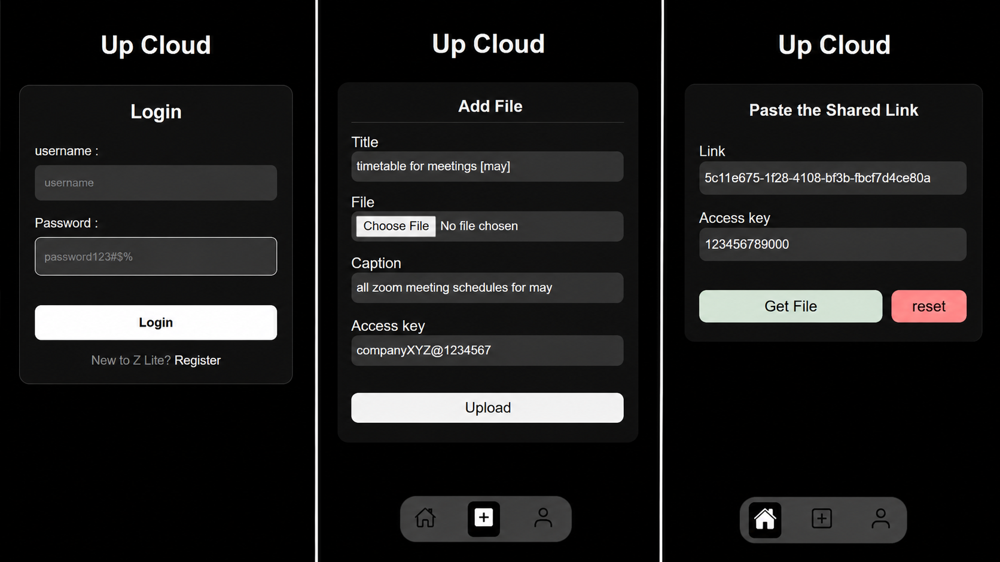
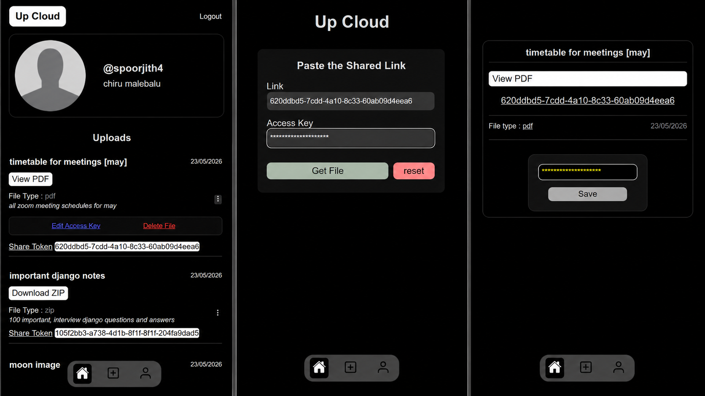
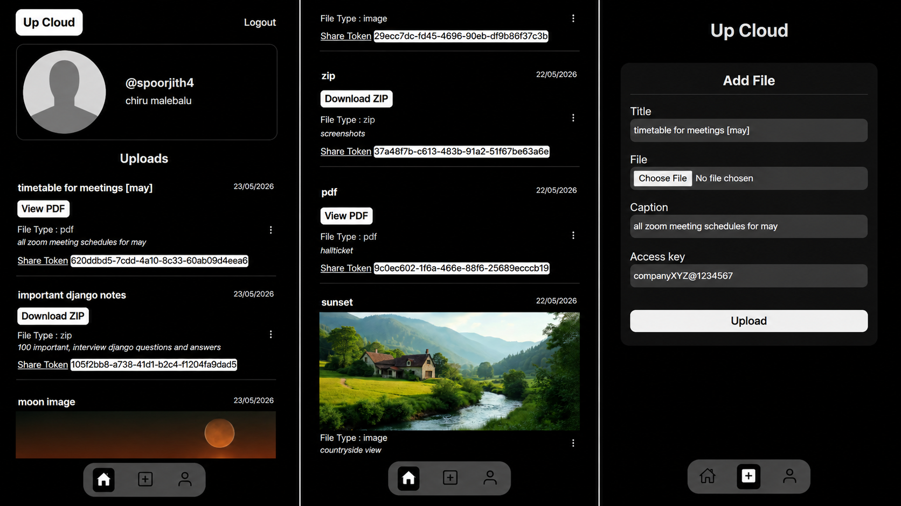

# File Sharing using Token
Upcloud is a file sharing application where users are authenticated. after logging in, users can upload files in there space which are protected.  
Only the authenticated and authorized users can access the file.  
A user can give the file to other users by giving the file (access Token & access Key) to get access to the file.

Built using Django REST Framwork, React.js, Simple JWT authentication, RESTful APIs

## Screenshots

## Features
- User Registration
- Authenticated users only
- save files online securely
- secure file sharing using (access Token & access Key)
